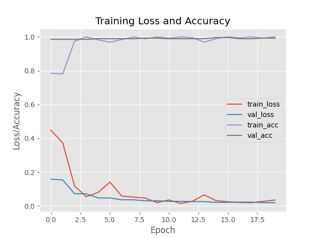

# 😷 Face Mask Detector

A real-time face mask detection system using **MobileNetV2**, **TensorFlow/Keras**, and **OpenCV**.  
This project detects whether a person is wearing a face mask or not using webcam input.

---

## 🎯 Goal

- Detect faces in real-time using webcam
- Classify detected faces as:
  - Mask 😷
  - No Mask ❌
- Display the result live with bounding boxes and confidence

---

## 🛠 Technologies Used

- Python 3.8+
- OpenCV
- TensorFlow / Keras
- NumPy
- Matplotlib
- scikit-learn

---

## 🧠 Model

- **Base model:** MobileNetV2 (imagenet pretrained)
- **Classifier:** Binary (Mask / No Mask)
- **Input size:** 224 x 224
- **Loss function:** Binary Crossentropy
- **Optimizer:** Adam
- **Epochs:** 20
- **Augmentation:** Rotation, Zoom, Flip, Shift, Shear

---

## 📂 Project Structure

face-mask-detector/
│
├── data/ # Training images (with_mask / without_mask)
├── models/ # Trained model (.h5) and label binarizer
├── utils/ # Utility scripts
├── main.py # Real-time mask detection script (with webcam)
├── train.py # Training pipeline
├── requirements.txt # Dependencies
└── README.md


---

## 🧪 Sample Output

> 

---

## 🚀 Run the Project

```bash
# Install dependencies
pip install -r requirements.txt

# Train the model (if needed)
python train.py

# Run mask detection with webcam
python main.py


📦 License & Contact
MIT License

Created by @kooroosh1363

# 😷 Face Mask Detector

A real-time face mask detection system using OpenCV, TensorFlow/Keras, and webcam input.
